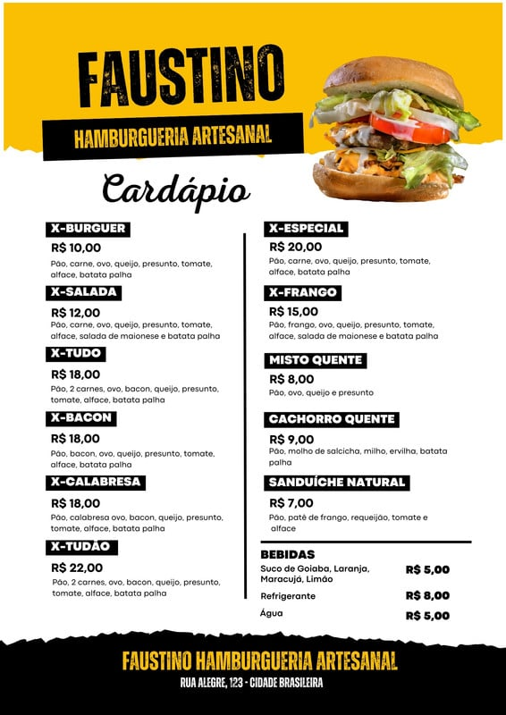
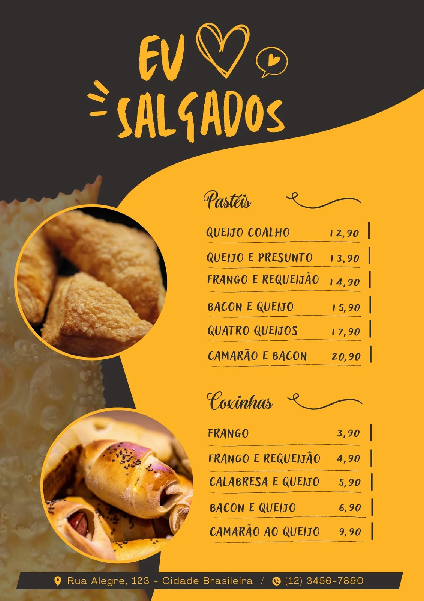

  <a href="https://infoextract.ai.tonilab.net">
    
    <h1>InfoExtract.AI</h1>
  </a>

  Take a picture of a menu or item and extract detailed data to streamline your cataloging process.

## Tech stack

- [Next.js](https://nextjs.org/) with TypeScript for the app framework
- [Shadcn](https://ui.shadcn.com/) for UI components & [Tailwind](https://tailwindcss.com/) for styling

## Cloning & running

1. Clone the repo: `git clone https://github.com/antonio-abrantes/infoextract.ai`
2. Create a `.env` file and add your GROQ and OpenAI API key's: `GROQ_API_KEY=` and `OPENAI_API_KEY=`
3. Still in the `.env`, You need to set your GLOBAL API key: `GLOBAL_API_KEY=`. You can create one on sites like [API key generator](https://generate-random.org/api-key-generator)
4. Create an S3 bucket (AWS or MinIO) and add the credentials to your `.env` file. Follow [this guide](https://next-s3-upload.codingvalue.com/setup) to set them up. All required values are in the `.env.example` file.
5. Run `npm install` and `npm run dev` to install dependencies and run locally.

## Example images for testing

  

  
    <h3>Exemple 1</h3>
  

    

  
    <h3>Exemple 2</h3>
  

    

  
    <h3>Exemple 3</h3>
  

